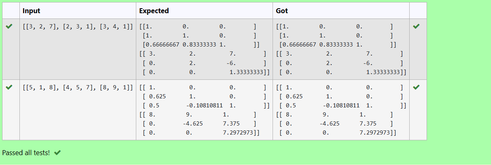
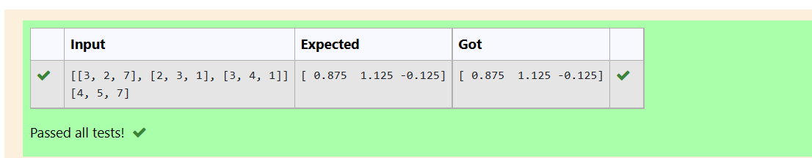

# LU Decomposition without zero on the diagonal

## AIM:
To write a program to find the LU Decomposition of a matrix.

## Equipments Required:
1. Hardware – PCs
2. Anaconda – Python 3.7 Installation / Moodle-Code Runner

## Algorithm
1. Start program
2. Assign values
3. Using scipy.linalg,we get two results(first is L matrix and second is U matrix) of the given matrix.
4. End the program

## Program:
```
/*
Program to find the LU Decomposition of a matrix.
Developed by: M/Sowmya
RegisterNumber: 21005357
import numpy as np
from scipy.linalg import lu
A = np.array(eval(input()))
P,L,U = lu(A)
print(L)
print(U)
*/
/*
import numpy as np
from scipy.linalg import lu_factor, lu_solve
A = np.array(eval(input()))
B = np.array(eval(input()))
lu, pivot = lu_factor(A) 
x = lu_solve((lu,pivot),B)
print(x)
*/
```

## Output:




## Result:
Thus the program to find the LU Decomposition of a matrix is written and verified using python programming.

